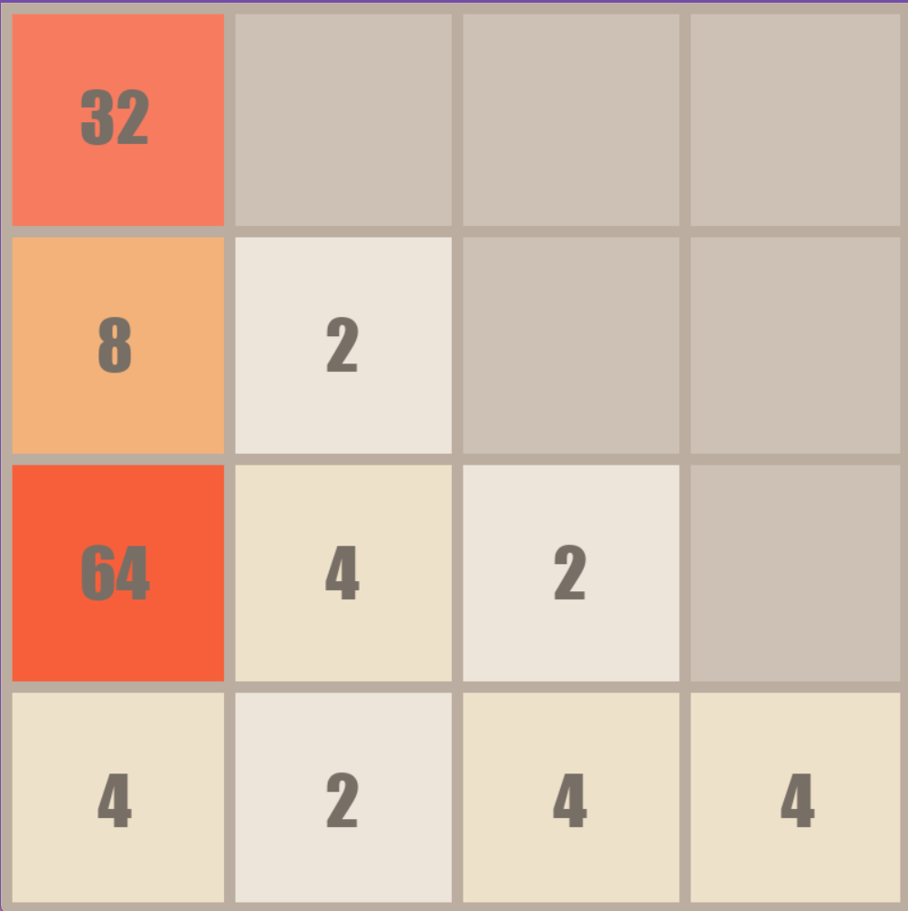
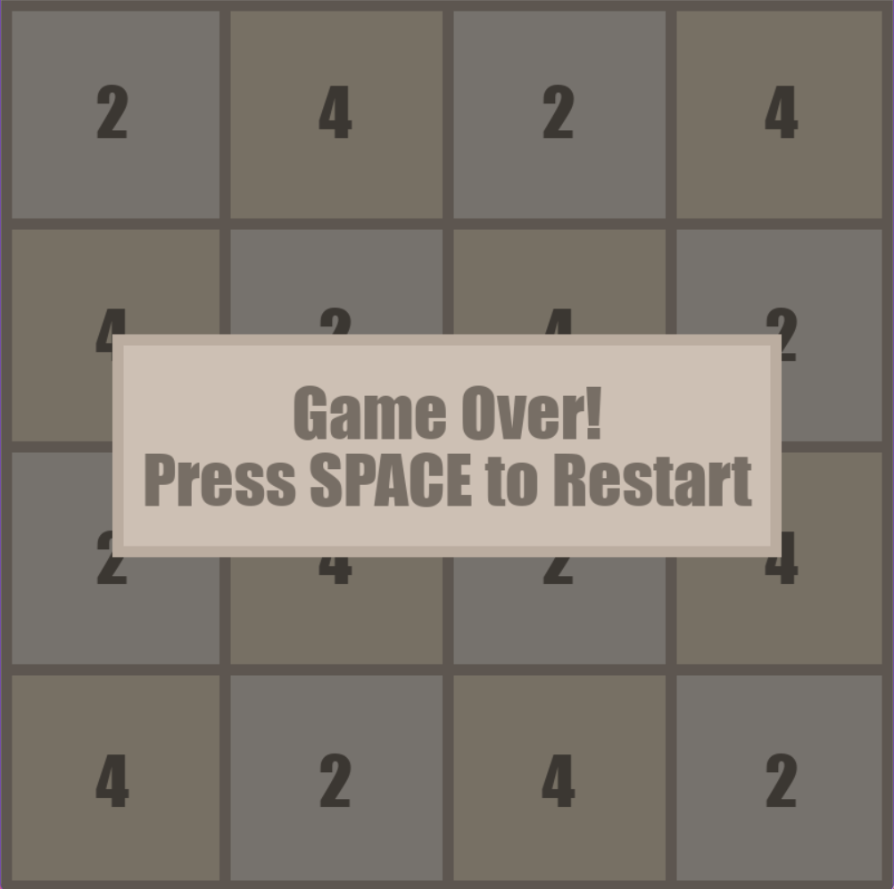
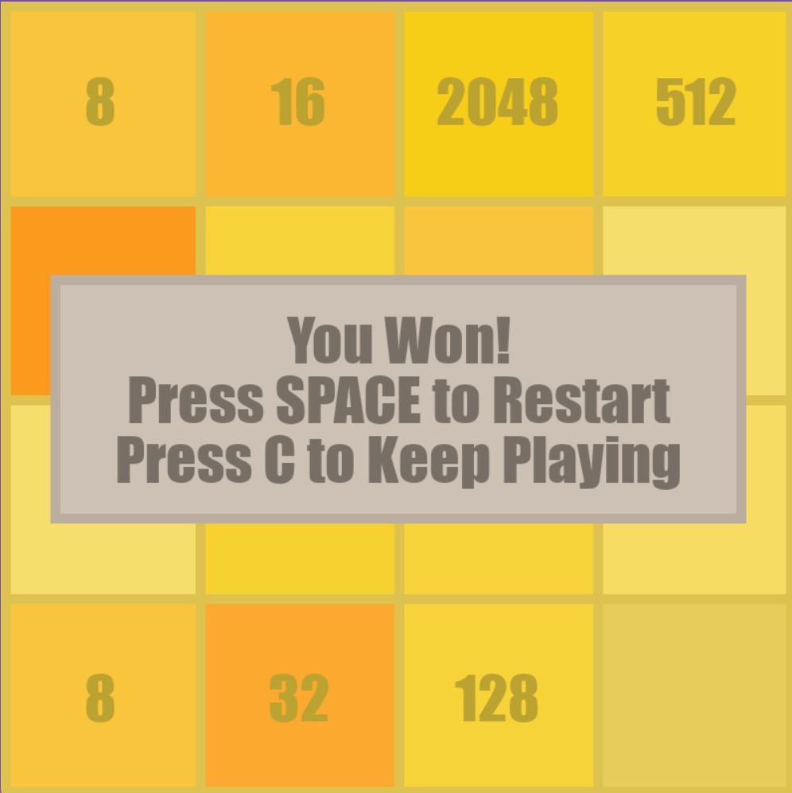

# 🔢 2048 Pygame Edition ✨
A faithful and visually appealing recreation of the popular 2048 puzzle game, built with Python and the Pygame library. Slide and merge tiles to reach the coveted 2048 tile and beyond!

## ✨ Features
- 🎮 Classic 2048 gameplay mechanics.
- 🖥️ Smooth and engaging tile animations.
- 🎨 Clean and simple graphical interface.
- 🏆 Clear win and lose states with interactive overlays.
- 🔄 Options to easily restart or continue playing after winning.
- 📦 Standalone executable available for easy play.

## 🔧 Technologies Used
- Python
- Pygame

## 🎮 How to Play
For those who just want to jump in and play without any technical setup:
1. Go to the [Releases](https://github.com/overstimulation/2048-python/releases) tab on this repository.
2. Download the latest `.zip` file under the "Assets" for the most recent release.
3. Extract the contents of the downloaded `.zip` file.
4. Inside the extracted folder, find and run the `main.exe` file.
5. Use your arrow keys to move the tiles on the grid. When two tiles with the same number touch, they merge into one tile with the sum of their values!

## 📸 Screenshots





## 💖 Contribution:
Contributions are welcome! If you have ideas for improvements, bug fixes, or new features, feel free to open an issue or submit a pull request. Let's make this game even better together! 🤗

## 🧑‍💻 For Developers:
If you'd like to clone the repository and run the game from the source code, follow these steps:
1. **Clone the repository:** Open your terminal or command prompt and run:
```
git clone https://github.com/overstimulation/2048-python.git
```
2. **Navigate to the project directory:**
```
cd 2048-Pygame
```
3. **Install dependencies:** This project requires Pygame. If you don't have it installed, you can install it using pip:
```
pip install pygame
```
4. **Run the game from source:** Once Pygame is installed, you can run the game directly:
```
python main.py
```

## 📝 Licence
MIT — free for personal and commercial use. See the [LICENSE](https://github.com/overstimulation/2048-python/blob/main/LICENSE) file for details.

---
Made with ❤️ by [@overstimulation](https://github.com/overstimulation)
